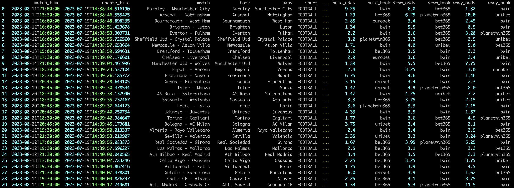
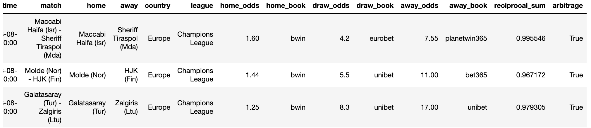

# Sport betting scraper

Scrape all desired sports and odds from [Oddsportal](https://www.oddsportal.com/). Furthermore you can check for arbitrage opportunities.

## Example scraped data
Example output of `scrape-once`. 


The following image depicts three arbitrage opportunities found after scraping

Not all rows are displayed in the images above.

After saving the dataframe, you can take a deeper look and manipulate it in a jupyter notebook.

You can take a look at the process of scraping the odds by providing the `not-headless` option. However it is recommended to scrape without `not-headless`, in order to speed up the scraping process. 

**Note** While scraping multiple browser pages are loaded at once. If your CPU is slow, your machine might freeze or function slower until the scraping is done. Thus you might want to lower the amount of `sports/countries/leagues` to scrape.


## Commands
List available commands with

```bash
python3 allusion --help
#or just
allusion --help
```
Output:
```
usage: allusion [-h] [-V] {create-config,scrape-once,list-data} ...

Sport betting bot

positional arguments:
  {create-config,scrape-once,list-data}
    create-config       Create template config
    scrape-once         Get the data and exit.
    list-data           Show the available data.

options:
  -h, --help            show this help message and exit
  -V, --version         Show bots version and exit.
```

## Install
Clone the repo and run
```bash
python3 -m pip install -r requirements.txt
python3 -m pip install -e .
python3 -m playwright install
```

You will need to create a config file, with the command
```bash
allusion create-config
```


**Note**: It is recommended to use a [virtual environment](https://docs.python.org/3/library/venv.html).
